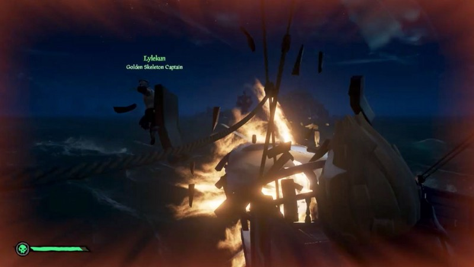
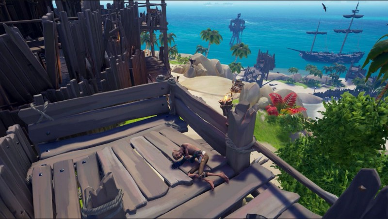
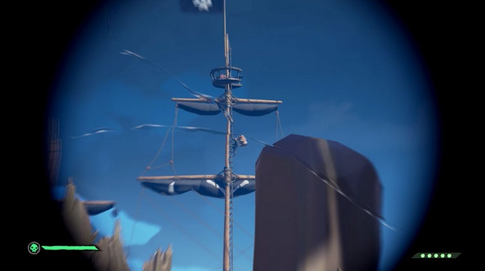

> The Continuing Tales from the Deck of the Holy Bartender…

I join Exareric for some high seas adventure, and after we stock our ship, we set sail for an active Skull Fort. As we approach we see a Galleon and a Brig circling the fort trading fire. We probe a bit to see if we can help one of them sink without much success. Eventually, the Galleon sinks, and we engage the brig. We’re doing a good job of it until we get too close to the fort and a lucky skelly shot knocks both of us off our ship, which is now stuck turning in a tight circle preventing us from getting to it or a mermaid. We watch with sadness as she sinks after taking fire from both the brig and the fort.

After spending so much time, we figure we need to go back and get our treasure. We respawn on our new boat and immediately set sail back. Right as the fort comes into range, the skull cloud disappears. They beat the fort, take the key and run. We give chase, but their brig is faster than our sloop and we can’t catch them.

We change tactics. I cannon over to the fort and hide (the vault is still full and closed) and Exareric sails away, making them think we’ve given up. I find a nice spot and sleep. I watch them come in, circle for a bit, send over a scout, who searches but fails to find me. Then they dock and open the vault. I wait patiently. Our plan is to wait till they load Bertha and then at the right moment, snipe it and wreck their boat.

They load their ship unawares and then I see it. They put it on the shore to load it last. I ask Exareric to start to sail back so they see him on the horizon and panic.

Then they grab the Stronghold Gunpowder Barrel and bring it aboard. I jump up and run down to the shore holding my trusty Eye of Reach. I see a member of their crew climbing the ladder to the crow's nest with the Barrel on his back. I stop, take aim, and fire.

I get hit registration marks, but no explosion!?

At this point they know I’m there. The pirate that was climbing the ladder immediately slides down. I reload and take \_another\_ shot. Again I get hit registration marks, but no explosion. He jumps overboard and they set sail.

We failed. We give chase, but they are not giving up and sail away from us at full sail knowing we’ll never catch up.

As a consolation of wasting our time, we engage a nearby Skellion. We didn’t think it through since our boat was poorly stocked as it was respawned. It takes literally every cannonball and every plank to sink it. We have 3 holes that we can’t patch and have to bail continuously to stay afloat.

To top it off, the Skellion only drops a skull and a crate of gemstones.

We limp to Morrow’s Peak, sell our meager treasure and call it a night.

**Sometimes, it’s hard to be a pirate.**

(Still was a good time. Thanks to Exareric for being a good crewmate and being a good sport about all the shenanigans.)

---

Clip starts from where I jumped down and failed: [https://www.twitch.tv/videos/453647314?t=01h15m31s](https://www.twitch.tv/videos/453647314?t=01h15m31s)

---

> **_“Fair winds and flowing seas”_**

Find me on Twitter:

[**Chenzo (@1Chenzo) | Twitter**  
_The latest Tweets from Chenzo (@1Chenzo). Part-Time Pirate on @seaofthieves; Full-Time HTML Wrangler, CSS Hack…_twitter.com](https://twitter.com/1Chenzo "https://twitter.com/1Chenzo")

---

Or join us on Capt. Logun’s Keelhauled PodCast Discord: [https://discordapp.com/invite/V7Cd4Kp](https://discordapp.com/invite/V7Cd4Kp)

---

[https://www.chenzorama.com/sea-of-thieves](https://www.chenzorama.com/sea-of-thieves)
