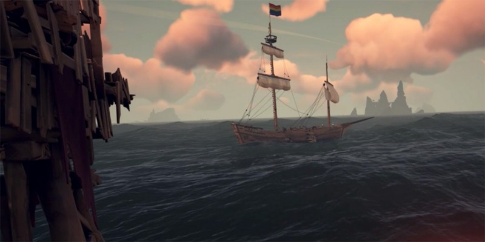
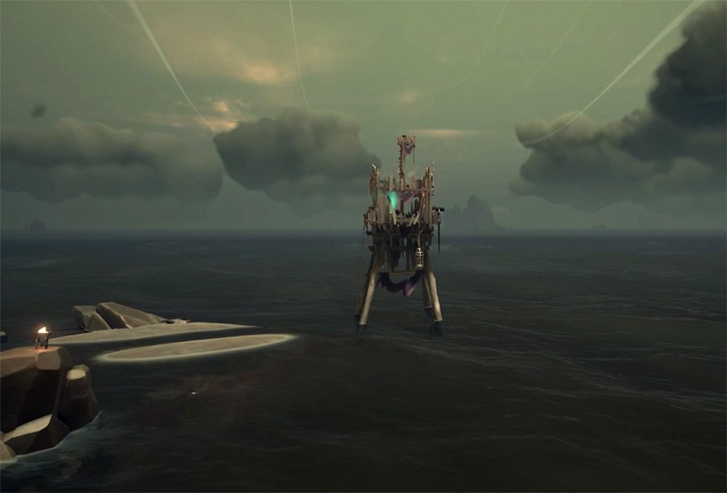

> The Continuing Tales from the Deck of the Holy Bartender…

One evening, I was sailing on a Galleon with DrnknnMunky, el Jefe Esteban and TNProfessor. the plan was to help Drnkn get his Roar Mercenary Voyage completed. Our galleon was lightly stocked so we decided to stop at a Skull Keep, which lay along the route to the Roar.

As we are approaching the fort, we spy a Brig, seemingly on an intercept course. We thought not much of it and just sailed right in and docked at the keep and prepared to go and gather supplies. We not going to bother them if they didn’t bother us. They’re probably just sailing to the nearby outpost. Merely passing by, perhaps.

But as we were prepping the ship to load, this brig swings around the fort and opens fire with no warning. Our crew immediately returns fire as I jump into their path and swim over to “say hello.” I board their ship and immediately attack but get struck down. Before I perish I let my crew that I only count 2 of them on board.

While on the ferry, I learn why there was a missing enemy crew member. TNProf lets us know that we were kegged — the missing 3rd crewman from the brig must have swum below the waves and brought a powder keg under our hull.

But it was poorly placed and there are not many holes which are quickly patched. When I return to the ship, our cannons are still firing at the enemy. After a quick look on their deck, I dive back over to the brig which is stopped VERY close to us. I board and slay them before they can finish patching and guard their ship until it sinks. They are no more.

After it’s over, we laugh and wonder why they were so adamant on trying to attack a larger foe when el Jefe notes that the fort vault is open with some trinkets left inside. Ah, they must have run with the good loot and left the rest and we ran into them coming back for it. While it’s not the priciest pieces, loot is loot and we happily bring it aboard.

And then, just as we were about to depart, el Jefe notices the telltale green glow of a skull coming from one of the fort’s towers. He swims over to investigate and low and behold: The all fort’s treasure all stockpiled up in the tower.

We assume the brig’s crew defeated the skeletal guardians of the fort but lost their ship during the battle. Then perhaps one of them stayed on the island hiding the treasure while the other two went to get their new boat. We just happen to be stopping at the fort right when they were getting there to recover their hidden treasure. (I thought I had noticed a mermaid in the water as we arrived.) The man left back on the island was the one who used a barrel from the fort to try to take us out.

Even though we only originally stopped for some supplies, we did get to practice one of my favorite pirate behaviors: Treasure Acquisition and Redistribution.

To end the night, we very excellently completed the mercenary voyage, sunk a skelly ship (in a matter of 90 seconds) and sold all the loot. I wish all my voyages went as smoothly.

---

> **“fair winds and following seas”**

Find me on Twitter:

[**Chenzo (@1Chenzo) | Twitter**  
_The latest Tweets from Chenzo (@1Chenzo). Part-Time Pirate on @seaofthieves; Full-Time HTML Wrangler, CSS Hack…_twitter.com](https://twitter.com/1Chenzo "https://twitter.com/1Chenzo")
