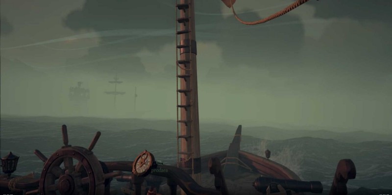
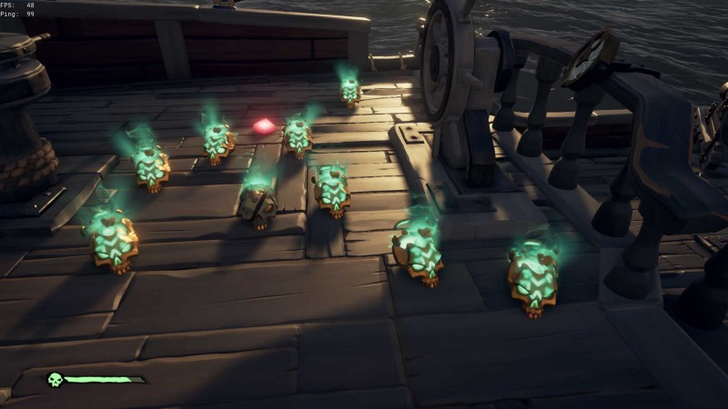

> The Continuing Tales from the Deck of the Holy Bartender…

Whilst me and my mate, Prodaea were anchored at Marauder’s Arch, digging up chests from our Gilded Gold Hoarders quest, we noticed a brigantine circling nearby. She was firing her cannons but at something we couldn’t see. We assumed it were a Megalodon based on her erratic sailing patterns. She didn’t seem interested in us, so we continued our digging while keeping one eye affixed on her position.

Halfway through our X’s, we noticed that same Brig was at full sail and headed straight towards us! We jumped back into our sloop, got her turned into the wind and dropped full sail. As we moved out, we watched our new friends sail right up to our island and raise sails. We had over a dozen chests on our sloop and I figured it would be smart for us to sell it off before we went over and said our friendly pirate hellos. After a quick trip to an outpost, we immediately set sail back to the Brig’s last known position.

The Pirate Lord must have been on our side because right then, a thick fog rolled in that blanketed our approach. From out the fog we crept, catching our friends unawares and ashore. We raised sail and raked their unmanned ship with cannon fire. One of the devils tried to sneakily swim out to our ship and stop us, but my pistol kept him in the water. The other scallywag dropped his sails and attempted to escape. Needless to say, neither the crew nor their ship survived the encounter.

And to our surprise and delight, from the grave of our friends rose 8 villainous skulls, a captains skull, and a ruby. Twas a fine night to be a pirate.

---

> **“fair winds and following seas”**

Find me on Twitter:

[**Chenzo (@1Chenzo) | Twitter**  
_The latest Tweets from Chenzo (@1Chenzo). HTML Wrangler, CSS Hack, Javascript Apologist, Video Game Snob, Dad — all…_twitter.com](https://twitter.com/1Chenzo "https://twitter.com/1Chenzo")
