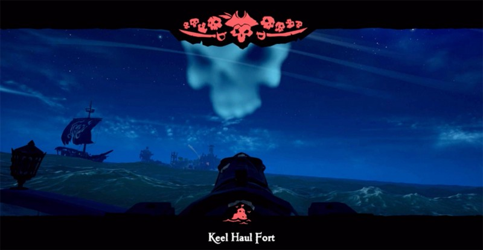
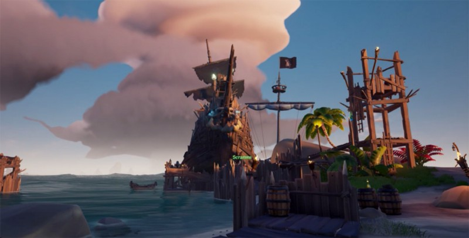
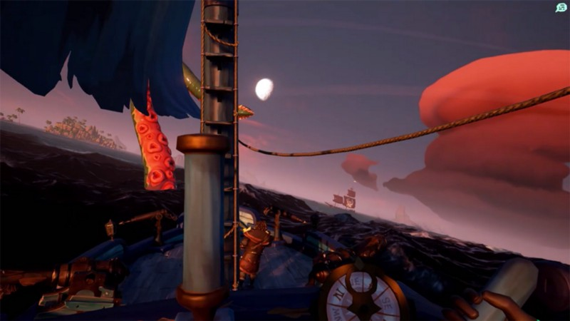

> The Continuing Tales from the Deck of the Holy Bartender…

Scramms and I are approaching our 2nd fort of the evening. From a distance, we see a Galleon is docked up alongside it and a sloop is also approaching the island and will arrive before we get there.

Moments later the Galleon is gone. We assume it was sunk by the sloop. We continue in and begin to take fire from the Skeleton-manned cannons. The sloop, which never docked, turns and engages us also. We pass the sloop trading fire. They try sending a boarder, but Scramms knocks him off. I begin to repair the ship but run into another enemy. She gets a couple of quick slices on me before I can block. Then a third pirate appears and cuts me down.

It was the galleon’s crew which apparently didn’t go down with their ship.

Things get worse as I return from the Ferryman, I hear the distinctive hiss of a barrel. Our barrel from our crow’s nest. It detonates right before I spawn killing everyone on our ship, dropping our mast, and filling our hull full of holes. Worse, we’re in range of the fort’s cannons which are firing non-stop.

This tale doesn’t end here.

I’m bailing and patching as best I can trying to keep us afloat. Scramms respawns and helps and gets the mast back up and we just able to limp away out of range and finish repairing.

We didn’t sink.

After a quick discussion, we decide to go right back to take the fort. The enemy sloop is docked and while Scramms circles the island, I cannon over. It’s taking skelly cannon fire and I get onboard and slay the pirate patching the holes. There’s a second pirate onboard too but he’s afk. And then dead.

With a little help from the cannons from our boat, we manage to sink the sloop and dock safely and finally have the Fort to ourselves.

This tale doesn’t end here.

As we’re happily killing the Fort’s Skelly’s, I notice a Skeleton ship sailing closer and closer to the fort. It doesn’t turn, beaches itself on the island, crashes into our ship and aggros. Scramms and I quickly return to our boat and open fire on the beached ship. Scramms bails water into their boat and I am able to hit them with a Ballast Ball. They spin and get free of the island and promptly sink once they’re in deep enough water.

I use a found rowboat to row out and pick up a couple pieces of loot from their sunken wreck while Scramms returns to the fort.

This tale doesn’t end here.

We defeat the fort’s guardians and get the vault key, but right at this moment an enemy Brig appears and is flying towards us at full sail. Down to our last 8 planks, we repair our wheel, bring the key aboard and set sail without any of the vault treasure.

They chase us but we keep turning into the wind and keep them behind us. Everything is going according to plan until the Kraken shows up. The worst possible luck! We hit her inky water and come to an almost complete stop and have to fight her while the Brig is given a chance to catch up.

In what must be the fastest I’ve ever slain a Kraken, Scramms and I are able to defeat her and turn our boat away from the brig just as she fires a boarder over to us. The ink clears and we start moving again. The boarder gets up the ladder but a couple of quick slashes knock him off.

We sail away from the brig again and with some expert sailing from my Pirate friend we get far enough away from the enemy that they lose interest and sail off.

We sail to Keel Hauled, open the vault, load up and are able to sell the loot without any more trouble.

---

> **“Fair winds and flowing seas”**

Find me on Twitter:

[**Chenzo (@1Chenzo) | Twitter**  
_The latest Tweets from Chenzo (@1Chenzo). Part-Time Pirate on @seaofthieves; Full-Time HTML Wrangler, CSS Hack…_twitter.com](https://twitter.com/1Chenzo "https://twitter.com/1Chenzo")

Or join us on Capt. Logun’s Keelhauled PodCast Discord: [https://discordapp.com/invite/V7Cd4Kp](https://discordapp.com/invite/V7Cd4Kp)

---

[https://www.chenzorama.com/sea-of-thieves](https://www.chenzorama.com/sea-of-thieves)
