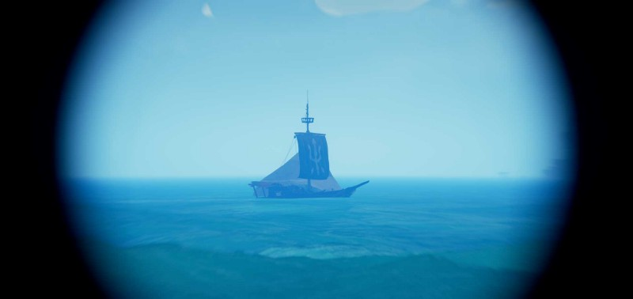
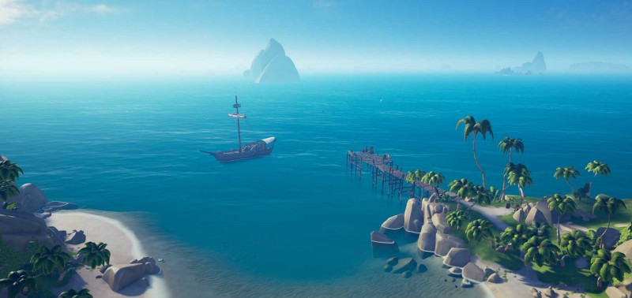
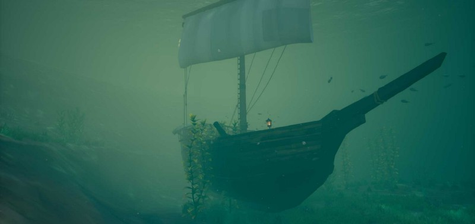

Here’s the TL;DR rules right up front:

1.  All other pirates want to kill you. Flee.
2.  Turn off all your boat’s lanterns.
3.  Scan the horizon for approaching ships. Always. (see #1)
4.  Don’t leave your ship unattended for long.
5.  Never have the anchor down for more time than it takes to stop your ship.
6.  Turn in your treasure often.
7.  All other pirates want to kill you. Flee.

---

This isn’t a ‘how to play SoT’ guide. I’m assuming you know how to sail, and complete voyages. Nor is this a list of reasons on _why_ you’d want to sail alone in a multiplayer game. Nor am I going to tell you what faction voyages to undertake or the best way to make money.

This guide is strictly some rules I follow to be able sail alone and not die (often.)

> edit: There’s a [small Reddit conversation happening here](https://www.reddit.com/r/Seaofthieves/comments/9ii9hq/beginners_guide_on_how_to_solo_sloop/). I’m going to add some of the Redditors’ better suggestions to the bottom of this post.

---

### **1\. All other pirates want to kill you. Flee**

Every other pirate wants to sink you and take your stuff. Or just sink you. Or just push you off your boat and steal it. Don’t let them get the chance. They can’t sink you if you never let them get close enough.

When you see another approaching ship, flee.

If you’re being chased, sail INTO the wind. The sloop is faster than the other boats while sailing into the wind. So, they’ll either fall farther and farther behind — or if you’re being chased by a sloop, they’ll never catch up.

To get maximum speed while sailing into the wind have your sails FLAT against the wind (not angled.) It doesn’t make sense, but your boat will go faster than your pursuers. (Thanks, [_tageeboy_](https://www.reddit.com/r/Seaofthieves/comments/9ii9hq/beginners_guide_on_how_to_solo_sloop/e6k8clb/)!)

> _Pro Tip_: If they won’t stop chasing you, set your boat on a clear heading. When they get lined up right behind you, jump off the side of your boat, swim into the path of their boat and try to catch on to their ladder. Get on board, drop their anchor and quickly kill as many as you can. Once your dirty work is finished, you can just jump off and mermaid back, or if they get you, take a ride on the ferry of the dead. Most likely your boat is still sailing along and you’ve removed the threat.

(I’d also like to take this moment to say that in SoT PVP is not griefing. Everyone else you meet is a pirate. Pirates stab things. Things like you.)

### **2\. Turn off your boat’s lanterns.**

Seriously… you’re lit up like a pirate christmas tree that’s on fire. At night you stand out on the horizon like a beacon that says “I’m a newb and lost, and please come over here and sink me and take all my stuff”

You won’t have to flee if no one sees you. Snuff those lanterns.

> _Pro Tip:_ The villainous skulls green glow is almost as bad as the lanterns and it’s even worse because that green glow means you _definitely_ have treasure onboard. Put them in the hold.

### **3\. Scan the horizon constantly for approaching ships**

Your best defense against other pirates is to know they’re coming. If a fully crewed galleon can bring it’s cannons to bear on your sloop, it’s sunk. But that’s also your fault for letting them get close enough. (see rule #1) By scanning the horizon you’ll be able to spot an oncoming enemy. You don’t need to go up in the crows nest. You can just jump up on the canopy behind the wheel and give a quick look.

If you see a ship keep an eye on it, if it starts getting too close, get your sail on.

### **4\. Don’t leave your ship unattended for long**

You’re going to have to go ashore to complete your voyages. When you do, try to not let your boat out of sight. If you need to go far from your ship, don’t lollygag and get back ASAP. Nothing is worse than finally catching that pig and coming back over hill to see an enemy Brigantine and the hull of your ship as it rolls over while sinking.

> _Pro Tip:_ You can still follow #3 while on land. Scan the horizon to know when you need to book it back to your ship.

### **5\. Never have the anchor down for more time than it takes to stop your ship.**

Always have your anchor up. If you need to stop, raise the sails BEFORE you need to stop and drift gently to a halt. If you need to stop suddenly, drop anchor, then raise sails, then raise anchor.

Then when you need to leave, you just drop sails and boom. Moving.

The reason you don’t want the anchor down is that it takes time to pull it up. Time that allows an enemy pirate to get closer to you. So, if you’re following rule #3, and see another ship coming, assume #1, they’re coming to get you. Get in your boat and get sailing.

A stationary ship is much, much easier to hit with cannons or board. Move.

> _Pro Tip:_ When you’re stopped, get your boat pointed in an escape direction. Don’t be pointed towards the shore and certain doom; be pointed out towards open sea and freedom.

### **6\. Turn in your treasure often.**

Why are you sailing around with 15 captains chests on your deck? Get to an outpost and turn them in. They can’t be stolen once you’ve given them to the gold hoarders.

There are 6 outposts throughout the islands. One’s gotta be close. Go stop at it.

> _Pro Tip_: Are you being chased while you have treasure you need to turn in? Sail close to an outpost, and when you’re right near it, jump overboard with a your loot. Swim to the shore and turn it in while your ship continues to flee on it’s own. Merperson back to your boat after you’ve got your money. (Be aware that your pursuers can see your merperson too.)

### **7\. All other pirates want to kill you.**

I mean, it’s the Sea of Thieves. They want your stuff. And your ship. And your life. You are going to get killed. It happens.

Inevitably, at some point you’re going to have enemies on your ship and every time you spawn they kill you. You’re going to feel trapped.

It’s ok.

You lost whatever treasure you had. Let it go.

Scuttle your ship from the Ferry of the Damned.

And if you respawn, perhaps they jumped off your thinking your gone. You’ll spawn on your still sinking ship. They might still be nearby. Unaware.

Find them.

Board their ship.

Be more pirate.

---

#### Reader Suggestions:

[**Kirbyr98**](https://www.reddit.com/r/Seaofthieves/comments/9ii9hq/beginners_guide_on_how_to_solo_sloop/e6juh8q/): When I get a map with a bunch of X’s, epecially on a large island, and you _know_ you’re going to be there quite a while, I just park my ship and assume it will be found. Instead of loading treasure on the ship as I find it, I just hide it in some bushes until I find them all. Then, if my ship is still alive I’ll load it all at once. If you come back to a mermaid, just take it, sail back on your new ship and pull right up to the bushes you left your loot in. This saves constantly worrying about your ship and you can take your time locating the X’s. I’ve never had anyone find my loot in the bushes, even after they’ve sunk my ship.

_Note: If your server merges while your loot is not onboard, you might lose your loot._

[**SirPantalones**](https://www.reddit.com/r/Seaofthieves/comments/9ii9hq/beginners_guide_on_how_to_solo_sloop/e6jvlb6/) notes: watch out for mermaids in the water when heading in for outposts. Getting ambushed by a crew with a scuttled ship after having done everything else right was no fun experience for me. :P

from [**ValyrianSteelYoGirl**](https://www.reddit.com/r/Seaofthieves/comments/9ii9hq/beginners_guide_on_how_to_solo_sloop/e6lou0w/): I’ll move the ship around the island so that it’s a quick run between the chests and the ship then utilize the cannons to get to my spots. I’m always keeping an eye on the horizon too. If it’s a riddle and I’m going into a cave for the dig I’ll usually move the ship closest to the cave too.

---

Part Two is now online. Read it here:

[**How to Solo Sloop in the Sea Of Thieves Part 2**  
_How to sail alone and survive, part 2._medium.com](https://medium.com/@Chenzo/how-to-solo-sloop-in-the-sea-of-thieves-part-2-c5e410539039 "https://medium.com/@Chenzo/how-to-solo-sloop-in-the-sea-of-thieves-part-2-c5e410539039")

---

> **“fair winds and following seas”**

Find me on Twitter:

[**Chenzo (@1Chenzo) | Twitter**  
_The latest Tweets from Chenzo (@1Chenzo). HTML Wrangler, CSS Hack, Javascript Apologist, Video Game Snob, Dad - all…_twitter.com](https://twitter.com/1Chenzo "https://twitter.com/1Chenzo")

Watch me sail alone on Twitch:
