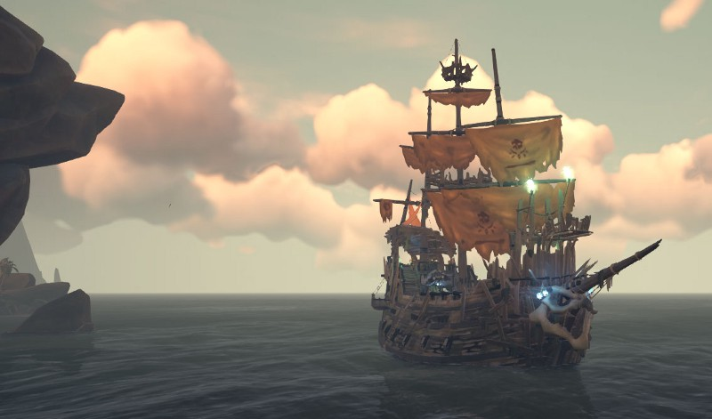
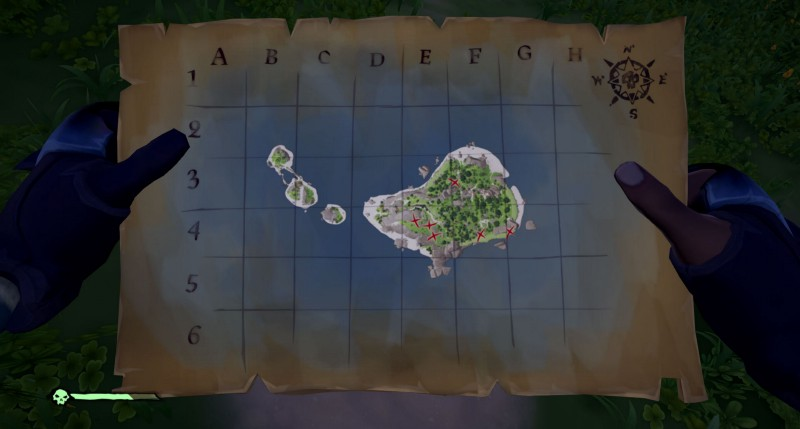
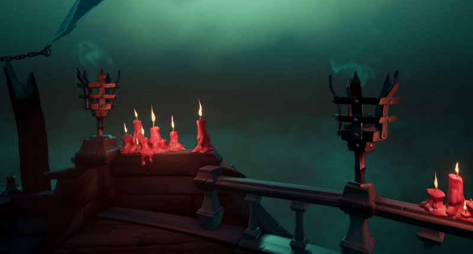

Here’s the TL;DR tips right up front:

1.  Use a sloop, not a brig
2.  Stock Up
3.  Prioritize bailing
4.  Run from Skeleton Galleons against the wind
5.  Raise sails and turn your wheel to fight the Megalodon
6.  Hide treasure instead of leaving it unattended
7.  Cancel quests that aren’t worth it

After solo slooping for a while now, and after this latest Shrouded Spoils update and it’s frequent encounter rate, I thought some of these new tips would be helpful for all my Solo-Sloop brethren and sistren out there.

> If you haven’t read my original how to Solo Sloop, you can go here and check it out:

[**How to Solo Sloop in Sea of Thieves**  
_Learn to sail alone and survive_medium.com](https://medium.com/@Chenzo/how-to-solo-sloop-in-sea-of-thieves-cc0835fa5d84 "https://medium.com/@Chenzo/how-to-solo-sloop-in-sea-of-thieves-cc0835fa5d84")

An addendum to the quick and simple guide on how to play Sea of Thieves by yourself. Seven MORE steps to keep you safe while voyaging during the Shrouded Spoils event and beyond.

Now, on to the tips on surviving alone on the Sea of Thieves:

---

### **1\. Use a sloop, not a brig**

You may be tempted to use Brigantine solo. You think, I can control the brig just fine. It’s still small enough to run about on deck easily, and it will go faster than the sloop. It might even look more threatening to other pirates out there. I mean, why not?

Because you’re wrong.

I’ll give you a couple of reasons why, but the primary one is that the _AI threats scale to the boat you’re on_. This means that a meg chomp does more damage to a Brig than a Sloop. So a Sloop will have an easier time repairing and fighting than Brig, which in turn will have an easier time than the Galleon.

Other reasons are: The sloop also has a tighter turning radius, quicker rudder action, and is faster to repair.

> Protip: you can look over the balcony behind the wheel of a sloop and see your map without walking down into the captains quarters. Set your map to your destination and you can steer yourself acurately around the seas with ease.

### 2\. Stock Up

Before you set out on your adventure, fill your boat with supplies. Check every barrel on the outpost you start at. Gather as many bananas, planks, and cannonballs as you can. Fill your boat up with these.

You can’t patch your boat without wood. You can’t fight another ship with no cannonballs. You can’t cronch without bananas.

Also, while you’re sailing to wherever, stop at islands on your way and pillage any barrels you find. Unmanned forts are wonderfully full of barrels just waiting to be pillaged. They also tend to be full of gunpowder barrels. These are handy for many reasons, just be sure to put gunpowder in your crows nest in case a stray shot detonates them.

(drop it like bombs behind you.)

> Pro tip: Get a rowboat if you see one. Rowboats are lifeboats. If your ship gets sunk and you find yourself (and all your hard earned treasure) floating in the sea, a rowboat becomes a lifeboat.

> The AI enemies will ignore it. So while that Skeleton Galleon managed to sink your ship, they didn’t manage to sink your spirits and you’d be able load up your treasure and hopefully row to safety.

### 3\. Prioritize Bailing

If you’re running from a galleon and you’re boat is getting recked, get pointed into the wind, make sure you’re going straight, and then just bail like your life depended on it (because it does… well, at least your boat and treasure.) And if the boat is not complete swiss cheese, you’ll be able to keep your boat afloat.

Once you get the water to knee-high below decks, you can quickly try to get a plank on a hole and then get back to bailing; Get it to knee-high, board up a hole, repeat.

You’ll be surprised how long you can keep a sloop above water with just a bucket.

### 4\. Run from Skeleton Galleons against the wind

You’re done for the night and you just want to get to an outpost to sell your loot and then the next thing you know is a skeleton galleon rises up next to you; what do you do? You do the same thing you do when it’s human pirates, _sail into the wind_.

Just like regular galleons, you’ll be able to slowly get away. Also, you’ll be them behind you and hopefully outside of their guns’ targeting arcs.

If you’re already going into the wind when they appear, turn the opposite direction of them and make a tight 360. Unfortunately, during this maneuver, you’ll be within targeting range of them and could get hit by a cursed cannonball but you’ll need to risk it.

Alternatively, if a meg shows up and gets aggressive, turn and sail WITH the wind. Just try to get outside its hunting range and repair any holes that might be chomped out of your ship. Be aware when you’re running from a meg that if/when it charges, get below decks to prevent yourself from getting blasted off your deck. You can’t repair your boat when you’re not on it.

But… you can beat Meg solo:

### 5\. Raise sails and turn your wheel 3/4 of the way when fighting the Megalodon/Kraken

It’s possible to fight and win against a Megalodon in a sloop alone. When you have one circling you, raise your sails completely, and then turn your wheel about 3/4 of the way in the direction the meg is circling you. This way your guns are on target for as long as possible. Then just open up with your cannons. If you’re well stocked you should be able to defeat her with a couple dozen well-placed shots.

She’ll take some chomps out of your boat and you’ll need to bail and repair, but the time between attacks should allow this and time to blast her. As stated above, if you see her charging try to get below decks do you don’t get knocked completely off and allow your boat to sink.

> Pro Tip: You can use your pistol or eye of reach to damage her as well, specially when she’s swimming around outside your cannons. Even better, you can have both pistol and Eye of Reach equipped and get some extra shots off.

(I’ve not fought the Kraken alone, but this method worked for me and a friend, I’m not sure how easy it is. I’ve heard it’s possible.)

Thanks to Captain Logan from the Keelhauled podcast for the turning tip!

[**Keelhauled: A Sea of Thieves Podcast**  
_Ahoy Pirates! Ep. 45 covers the information about feedback received by Rare regarding the recent update with Shrouded…_captlogun.podbean.com](https://captlogun.podbean.com/ "https://captlogun.podbean.com/")

### 6\. Hide your treasure on an island instead of packing it all into your boat

Once you get to a higher level with the Gold Hoarders, you’ll be getting maps with 4 or 5 X’s on it. And on larger islands, this might take you a little bit of time to find and dig up.

The problem arises when you find a chest, load it on your ship and then wander out of sight of your ship. Then you find another chest, bring it back to your boat. Then after you leave and third time and spend 5 minutes finding a chest, fighting skels and digging it up and get back to your boat, it’s sunk and your first 2 chests are already onboard the enemy Galleon that’s shown up.

Think like a pirate, and while we can’t bury our treasure, we can hide it. Find a bush or a nook and cranny to hide your treasure before you load it on your boat. You can place it in a bush or around a set of barrels or something. Preferably near shore for easy loading.

> Pro Tip: Place your chests right on top of each other as well. So they take up as little space as possible.

Then when you’ve found your last chest, go and grab your hidden chests quickly so you’re always ready to run when you need to with minimal monetary loss.

### 7\. Cancel Quests That Aren’t Worth It

Get a map with 1 treasure chest on it? (or worse, did you get a riddle quest on an island larger than the country of Brazil?) Cancel it and get a new one. Order of souls quest for 1 pirate captain on Old Faithful Isle? Cancel it. The loss of a couple hundred gold is worth it if you can get a quest for 4 captains on Lonely Isle.

_Time is money and rep._ Why spend 30 minutes digging up _one_ chest, when you can spend 40 digging up _four_?

Merchant quests are just as terrible. Ones with Pigs are even worse. I recommend getting snake or chicken quests that ask for at least 1 gold animal. They tend to sell for the most gold (black animals are a close second.) If the quest doesn’t have them I cancel it and try again.

Then I sail to the island that has the beasts I want that is closest to the drop-off. I built an interactive map to help me (and you) find the animals you:

[**Unofficial Interactive Sea Of Thieves Map**  
_An open source interactive map of the sea from the Rare's game Sea of Thieves. Right click to find closest animals…_seaofthievesmap.chenzorama.com](https://seaofthievesmap.chenzorama.com "https://seaofthievesmap.chenzorama.com")

> Pro Discussion: I’ve heard theories about getting merchant quests, collecting the baskets from them and then canceling that quest. You do this a couple of times and fill up your boat with snake, chicken and pig baskets. Next, sail to an animal infested island, fill up your baskets with gold animals, then sail to an outpost.

> Once there, keep buying merchant quests that require the animals you’ve got and you’re already done.

> In my opinion, this seems like it will take too much time and cost too much in just thrown out merchant quests. Time is money.

In closing, I’d just like to remind you, while you’re solo slooping, there’s a non zero chance of getting sunk or murdered or both. Over a long enough timeline, it’s inevitable. Assume you’ll sink. Turn in treasure often to minimize loss. Play some music with your boat as it goes down.

Respawn. Get a new Sloop. Set sail anew.

---

### Reader Tips:

AntiPrincess has a good point here. Use Skeletons as unwitting crewmates? Smart.

---

> **“There are three sorts of people; those who are alive, those who are dead, and those who are at sea”**

Find me on Twitter:

[**Chenzo (@1Chenzo) | Twitter**  
_The latest Tweets from Chenzo (@1Chenzo). HTML Wrangler, CSS Hack, Javascript Apologist, Video Game Snob, Dad — all…_twitter.com](https://twitter.com/1Chenzo "https://twitter.com/1Chenzo")

Watch me sail alone on Twitch:
