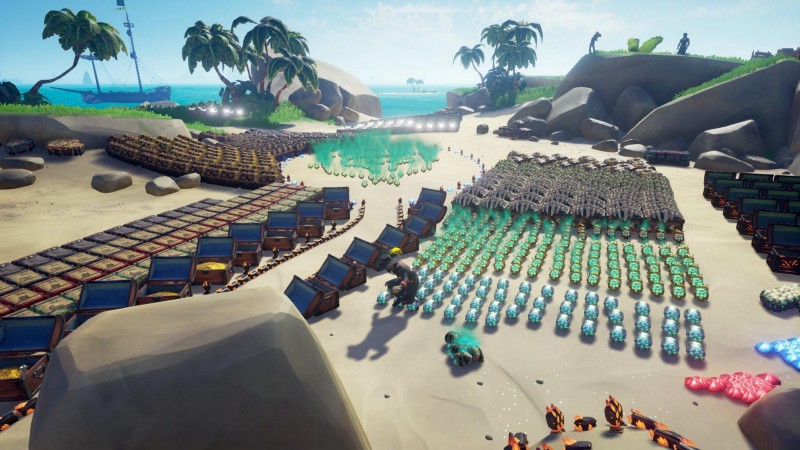

I would like to submit that PvE only (or private servers\*) would be a bad thing for Rare to do in Sea of Thieves and ultimately lead to the demise of the game.

---

The reasons against are

1.  The game was built from the start as both **PvE and PvP together** in a **shared** world. 
2.  Players are playing on PvE only servers that earn gold and rep cheapen the accomplishments of those who play the game with _all_ the game’s threats.
3.  Time building and supporting PvE servers removes the Devs from the time where they could be adding new content or fixing bugs 

---

### The game is designed to be PvPvE in a shared world

The game’s description in the MS Store contains this sentence… “_Sea of Thieves is a multiplayer, shared-world adventure game…_” The keyword here being _shared-world_. Private/PvE servers close the door on other players turning this shared-world into a private-world.

If we start splitting SoT into separate servers based on individual playstyles, we’d lose a lot of the magic that makes this game great.

The game is PvPvE. It is built on the two pillars of PvE and PvP. If you take one away the game becomes something else. Something less. And we would be worse for it.

PvE only servers would change our favorite pirate game to a Fetch Quest Sailing Simulator game…

…and then the original game no longer exists. We need to have actual pirates in our pirate game.

Let me [quote](https://www.seaofthieves.com/world-events) from the official Sea of Thieves website (from the Friend of Foe section):

> …you’ll soon encounter other ships and crews as you undertake your voyages. It’s up to you how you interact and what kind of crew you choose to be. Create allies or enemies, be benefactors or betrayers, exchange banter or broadsides — you make the call! Of course, what you can’t know in advance is how other ships’ crews will react upon seeing you…

It’s literally in the description of the game that other players are sailing around in the same waters, and perhaps, they might just shoot you.

#### It is not safe in the Sea of Thieves. 

But the threat doesn’t come from AI-controlled NPCs. It comes from Blood Thirsty Pirates.

After you’ve played for a bit, none of the AI threats are really a threat anymore. A decently crewed ship will have no trouble fending off a Megalodon or a Kraken.

But even experienced pirates will sometimes run into trouble when a well sailed, well-crewed Brigantine wants your treasure (or even just your lives)

And getting chased — or chasing — is really the heart of the game. Learning to defend and run or sneak up and sink is where the game really becomes like no other.

> The Sea of Thieves is neither a single player game nor a casual game. 

The threat of that ship on the horizon being an intelligent hostile force is a key difference between this game and a couch Co-op.

Just joining a PvE server to grind out your rep/gold without a threat is a casual experience that doesn’t exist (and shouldn’t. We can talk about Alliance/Fleet servers a little farther down.)

---

### **Pirate Legends that earned their legendary status on PvE servers are not true Legends…**

and the ability for them to acquire the same cosmetics and glory and status while sailing in a completely safe world is a slap in the face to pirates that earned their Purples in the dangerous waters of the open Sea of Thieves.

Almost all pirates have had their ship sunk and loot stolen while climbing the ladder to PL. It’s part of the game. There’s something about the heart-racing flight across the sea while clutching your hard-earned booty as you flee from marauders that makes that Captains Chest worth more than it’s gold you get from the gold hoarders. Even the gut-wrenching feeling when you respawn to your ship during a battle, only to find it new and afloat somewhere else, your old ship sunk, your loot plundered is a bittersweet but a necessary part of the magic of Sea Of Thieves. It’s part of our shared experience. 

Allowing some players to avoid this is akin to letting them boost.

> You shouldn’t get the same rewards in a game, if you’re not willing to play the same game.

Players from the early days got to PL before you could buy letters of recommendation. And I can remember hearing grumbles after that was added that it cheapened the PL status.

Alliance and shared rep was not a thing…

Let me quote a grizzled veteran from our discord server:

> (insert back in the day voice) I got my legend in May of 2018 when you still got Castaway chests on level 50 missions and you actually had to grind merchant. Because of the time it took you knew your islands, the sand bars, cannon placements. l made PL10 by August. For Athena missions to count you had to deliver animals. God forbid you got sunk and lost your cages and had to start over. You had to turn in the 96 chests. There was no “get Athena rep while not doing an Athena mission”. You couldn’t buy levels, you put in the time and got a good crew to pull all of you through it together.

It IS much easier, now. But it is nothing compared to being able to jump into a PvE / Private server where you could alliance up with 3 or 4 or even 5 other crews also doing Athena missions. _And this is happening now via Fleet Servers…_

---

### The Devs are busy. Let’s not give them something else to work on.

Seriously, PvE only servers should be the LAST thing they should work on, and then have to worry about supporting.

Bug fixes, more Tall Tales, Captaincy update… _literally anything else_. Let’s fix and improve the game we all love instead of making a new one. 

---

### Alliance/Fleet servers are just as bad as PvE servers. Perhaps worse.

Take a look at this image:

There’s no way you could put all this down on an island in a real server. The time alone required to put it here is mind-boggling and there’s no way someone wouldn’t come by and see it and then spend the rest of their time trying to steal even a part of it. 

People that build and sail in Alliance/Fleet servers are, imo, as bad as boosters and perhaps, hackers. 

They are abusing game mechanics to make themselves safe. 

Pirates that have gained Pirate Legend status in these servers are not true Pirate Legends. They are Paper Legends. 

I know several Pirates that hang out on fleet servers. They’re good people and I’m not hating on them. But I do think they’re cheating themselves (and the rest of us.)

> I mean the hashtag is #bemorepirate not #besafepirate or #leavemealonepirate why not actually be a pirate?

---

Let me answer some common rebukes to the no PvE server mindset:

**What about Newbies?** they were just given the maiden voyage to learn. Otherwise, they’ll need to learn to swim the hard way like the rest of us. To shield them from the ‘real’ sea of thieves is a disservice to them. If you’re shielded from the PvP aspect of the game you’ll never learn to handle it. And it’s much better to learn that when you lose a seafarer’s rather than when it’s a ship full of athena loot. 

**What about Families? What about Children?** The game is rated T. Families DO sail and cause a ruckus. But trying to make the game E is, again, changing the game for the worse. Any teen should have no trouble sailing the seas. (And I suspect many a T pirate has sunk me.)

**What about a PvE Free Neutral Area like the Sea Dog Tavern in the middle of the map?** This would be abused by griefers. They would circle it forever. They would run to it when attacked. 

---

_\*caveat: I’m all for them releasing private servers for content creators for filming or racing or games if you don’t accrue gold or rep._

---

> **“fair winds and following seas”**

I’ll happily have a civilized discussion about this in the comments or hit me up on the twitters: 

[**Chenzo**  
_The latest Tweets from Chenzo (@1Chenzo). Part-Time Pirate on @seaofthieves ☠️ Watch: https://t.co/z8wC4u4K4h ☠️…_twitter.com](https://twitter.com/1chenzo "https://twitter.com/1chenzo")
